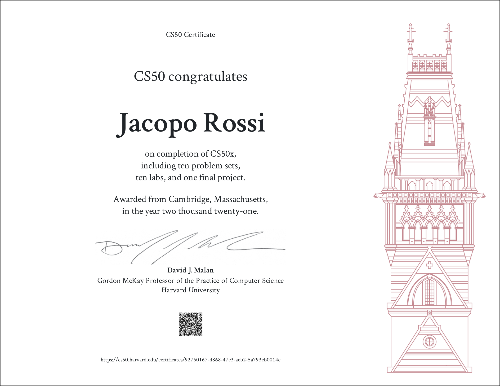

# CS50 Introduction to computer science

I made this repository to showcase my solutions to [CS50 2020](https://cs50.harvard.edu/x/2020/) problem sets. This course is Harvard University's introduction to computer science which I took during 2020. It is composed of 7 lectures, each fallowed by a problem set that challenges the students to use what they learned and program a solution to a specific problem. The course ends with a final project in which you are asked to create from scratch your own first program. For this I created Fantasy Brawl a side-scrolling beat 'em up game which you can download and play from [here](https://drive.google.com/file/d/1S5wQfL22Cm_Mc7xcHaygBOiZ86VovC2w/view)

## Certificate

## Disclaimer

Please don't just copy the code mindlessly without trying to solve the problems yourself, it's totally pointless if you actually wanna learn how to write software and a blatant violation of the [Academic Honesty](https://docs.cs50.net/2016/fall/syllabus/cs50.html#academic-honesty) policy of the course.
